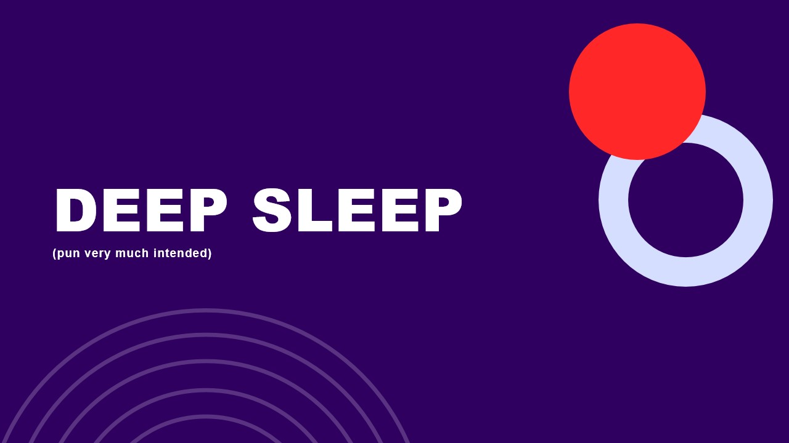
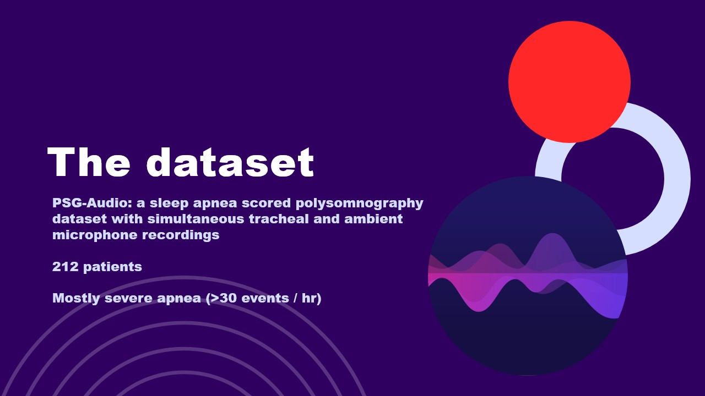
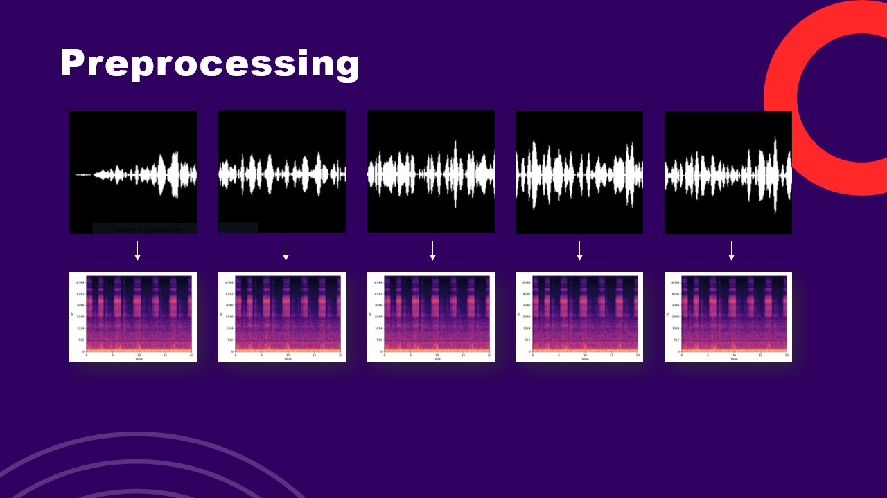
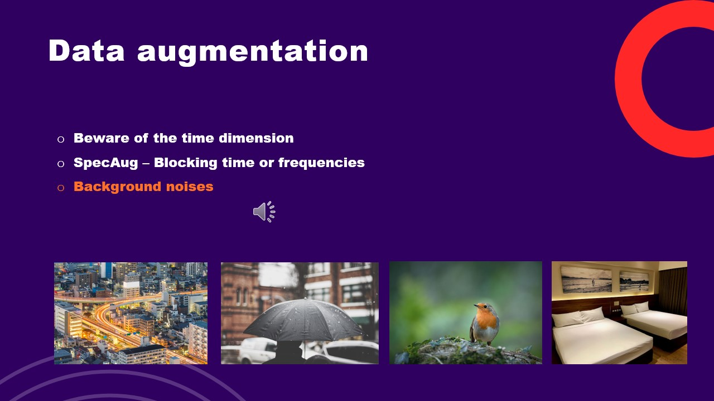

# Sleep Apnea Classification Using Audio Recordings

## Introduction
This project is the final project for my Data Science Retreat bootcamp. 
It aimed to classify types of sleep apnea based on audio recordings of breathing sounds. 
Using the [PSG-Audio dataset](https://www.nature.com/articles/s41597-021-00977-w), I developed a convolutional neural network (CNN) to classify 
spectrogram files of different apnea types (obstructive apnea, hypopnea, mixed apnea, central apnea) 
and non-apnea events. The goal was to enable at-home analysis of sleep apnea using smartphone microphone 
recordings.

## Outcome
Using various techniques such as data augmentation with ambient background noises, pre-trained CNNs (ResNet50 and ConvNext),
- I achieved a validation f1 score of **0.8 on two classes** (No Apnea | Obstructive Apnea), and a validation f1 score of **0.67 on three classes** (No Apnea | Hypopnea | Obstructive Apnea).
- **Central and Mixed Apnea were removed** as classes due to severe class imbalance.
- The **best performance** was achieved with a pretrained **ConvNext** with the final layer unfrozen.

| Model | num_classes | test_f1 |
|-|-|-|
| Baseline CNN | 2 (No apnea, Obstructive apnea) | 0.76 |
| ConvNext | 2 (No apnea, Obstructive apnea) | 0.81 |
| Baseline CNN | 3 (No apnea, Hypopnea, Obstructive Apnea) | 0.57 |
| ConvNext | 3 (No apnea, Hypopnea, Obstructive Apnea) | 0.65 |

## Background
The **sleep apnea syndrome** is a chronic condition that affects quality of life and increases the risk 
of severe health conditions such as cardiovascular diseases. However, the prevalence of the syndrome 
in the general population is considered to be **heavily underestimated** due to the restricted number of 
people seeking diagnosis, with the leading cause for this being the **inconvenience** of the current reference 
standard for apnea diagnosis: Polysomnography. Various home-based apnea detection systems are being 
developed, profiting from information in a restricted set of polysomnography signals. Better results are
achieved by incorporating various signals, including EEG, ECG and EKGs, blood oxygen saturation as well as
heart rate.

However, in this project, I purposefully limited myself to using **breathing sounds exclusively**. I did this to set myself
an interesting challenge, to limit the scope of the problem to be achievable in the limited timeframe of
the project (two-and-a-half weeks), but also because the ambition of the project is to develop an **easy-to-use
at-home solution** that can be used without the need for additional equipment or expensive wearables, enabling more people to use the solution.

## Dataset
The **PSG-Audio dataset** is a freely available open-source dataset comprising 212 polysomnograms 
along with synchronized high-quality tracheal and ambient microphone recordings. This dataset is 
crucial for developing and testing my model. I would like to extend a special THANK YOU to the team who spent time and resources to create
this dataset and make it available for free.

## Solution Approach
A **convolutional neural network architecture** was used to classify the spectrogram files of different apnea types and non-apnea events based on ambient recordings alone. The process involves several key steps:

### Data preprocessing:
1. **Data Preprocessing**: Key challenges of this project were handling large volumes of data. The PSG-Audio data is stored in the EDF file format (European File Format), while the labels are stored in RML files. Data preprocessing included the following steps:
   1. **Creating folder structure**: The project folder structure that is used to save and move files around is created in the destination folder (repo clone destination).
   2. **Downloading the files**: A list of download URLs is provided and files and corresponding labels are downloaded and saved in the project-internal file structure.
   2. **Label dictionary**: Extracting labels with timestamps and labels into a label dictionary.
   3. **Extract sound signal**: Extracting the sound signals based on the timestamps.
   4. **Convert to WAV**: Converting the signals into WAV files.
   5. **Convert to mel spectrograms**: Converting the WAV files into mel spectrograms.
   6. **Train val test split**: Splitting mel spectrograms randomly into train, validation and test.
   7. **Data augmentation**: Augmenting training data with ambient background sounds.

2. **Dataset creation**: I modified the base PyTorch Dataset class to create a dataset to be used with PyTorch. 
   1. **Labels**: Text labels were converted into one-hot encoded labels.
   2. **Transform**: Files are resized to 224x224 and transformed to PyTorch tensors.
   3. **Normalization**: Mean and standard deviation of the training data is calculated to normalize tensors.
3. **Model Training**: Different convolutional neural networks (baseline, pretrained) were created and trained. Class weights were used to address class imbalance between classes.
   1. Optimizer: Adam
   2. Learning rate: 0.001
   3. Dropout: 0.3
   4. Criterion: BCEWithLogitsLoss
4. **Model Evaluation**: Model performance is evaluated with the test set.

## Model Architecture
1. Baseline CNN:
   1. 3 convolutional blocks with MaxPool2D and Conv2D layers, followed by a ReLU activation function.
   2. Flattening layers followed by 2 fully connected layers with logits as the output.
2. ResNet50:
   1. Pretrained model with final fully-connected layer unfrozen.
3. ConvNext:
   1. Pretrained model with final fully-connected layer unfrozen.

## Future Work
This prototype will need further improvement before it can be used in at-home use on a smartphone.
- **Pre-trained models in domain**: It could be beneficial to attempt using pre-trained models that were specifically trained with breathing or even sleeping sounds. The model landscape in that domain is sparse, but there are a few promising examples.
- **Performance Improvement**: Further signals need to be extracted from the audio signals to improve model performance.
- **Model Quantization**: Quantize the final model to allow it to run on mobile devices.
- **Real-time Analysis**: Implement real-time apnea detection using smartphone microphones.
- **Enhanced Noise Reduction**: Develop advanced noise reduction techniques to improve classification accuracy.

## Acknowledgements
- The authors of the PSG-Audio dataset for providing the data.
- Iskriyana und Markus for their support and mentorship.
- Rahul for his input and collaboration during the project phase.
- Jose, Abin, Arun and all the teachers of Data Science Retreat who taught and supported us.
